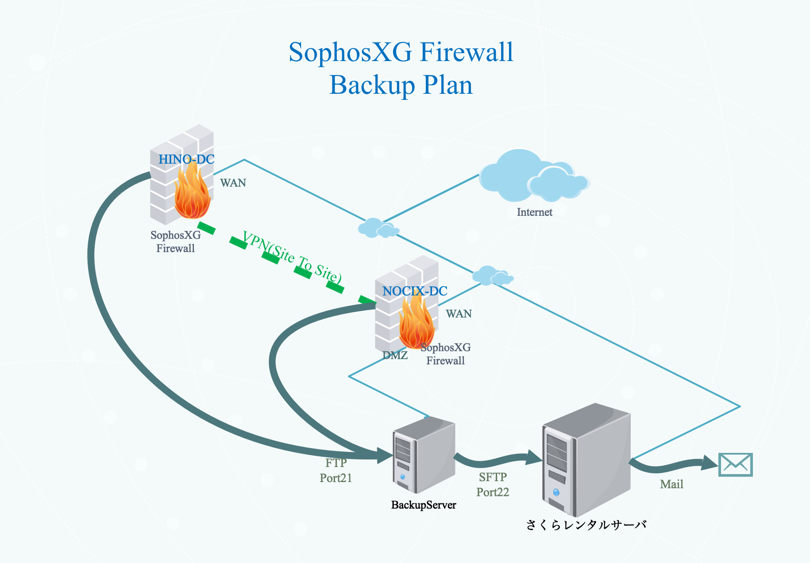

### バックアップ構成概要

各拠点のSophosXGのコンフィグのバックアップを次の３箇所に日次で作成する。
  * バックアップサーバ
  * さくらレンタルサーバ
  * 管理用メールボックス

バックアップは下記の要項で実施する。
1. SophosXG標準機能で、日次でバックアップへFTPでアップロードする。
1. バックアップサーバもSophosXG影響下にいる為、SophosXG野￥コンフィグをさくらレンタルサーバへもSFTPでアップロードする。（バックアップサーバ上のCronでバックアップバッチを実行）
1. さくらレンタルサーバのメールサーバを使い、圧縮したSophosXGのコンフィグをメールで送付する。

### バックアップ構成設定値

#### NOCIX-DC拠点

| 項目 | 設定値 |
| :--- | :-- |
| バックアップモード | FTP |
| バックアップのプレフィックス | NOCIX |
| FTPサーバのIP | 172.16.16.99 |
| ユーザー名 | backupuser |
| パスワード | *************** |
| FTPパス | Backup/SophosXG |
| 頻度 | 毎日 |
| スケジュール | 00:00 |

#### HINO-DC拠点
| 項目 | 設定値 |
| :--- | :-- |
| バックアップモード | FTP |
| バックアップのプレフィックス | HINO |
| FTPサーバのIP | 172.16.16.99 |
| ユーザー名 | backupuser |
| パスワード | *************** |
| FTPパス | Backup/SophosXG |
| 頻度 | 毎日 |
| スケジュール | 00:00 |

#### バックアップサーバ
| 項目 | 設定値 | 備考 |
| :--- | :-- | :-- |
| SophosXGコンフィグ格納ディレクトリ | /var/backup/SophosXG/ | |
| 保管日数 | 6ヶ月 |  |
| さくらレンタルサーバへのアップロード用バッチ | /var/script/0210_SophosXG_backup.sh | 　 |
| その他 | Cron設定状況は【XXXXXXX】を参照|　|
