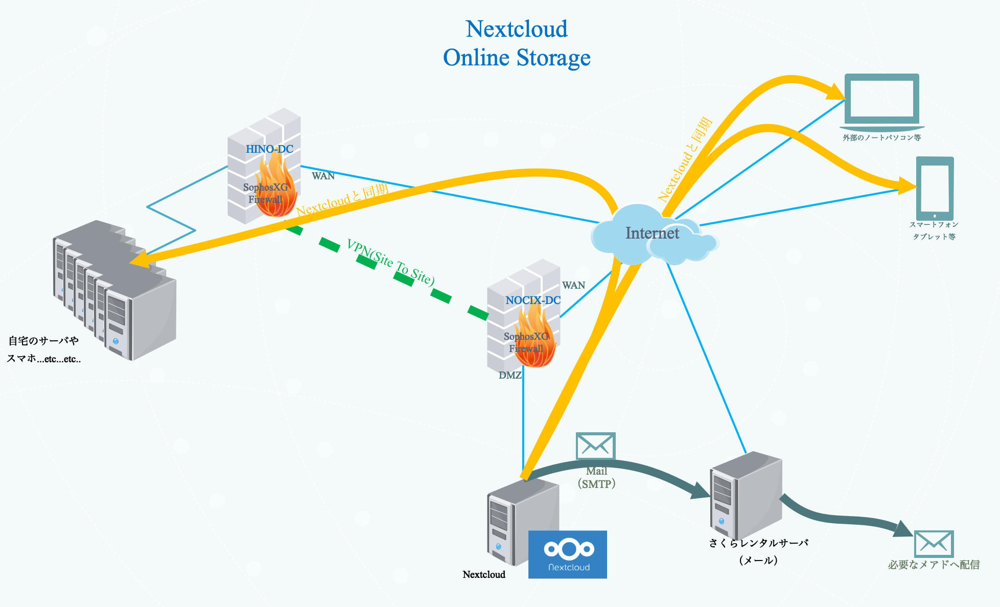

# オンラインストレージ(Nextcloud)

## オンラインストレージ設計概要

　オンラインストレージは、インターネットに接続されているパソコンやスマートフォン等からデータの保存、読み出しが出来るサービスである。  
　また、本システムで採用するオンラインストレージは保管したデータをシステムへの登録不要かつセキュリティにも留意し第３者と共有する機能も必要とする。  
　結果、本システムで導入するオンラインストレージを提供するソフトウェアとしてNextcloudを採用した。
　サーバはNOCIX拠点に借りている専用サーバ上に仮想マシンとして構築し、自宅のサーバへ日時バックアップを作成する。
