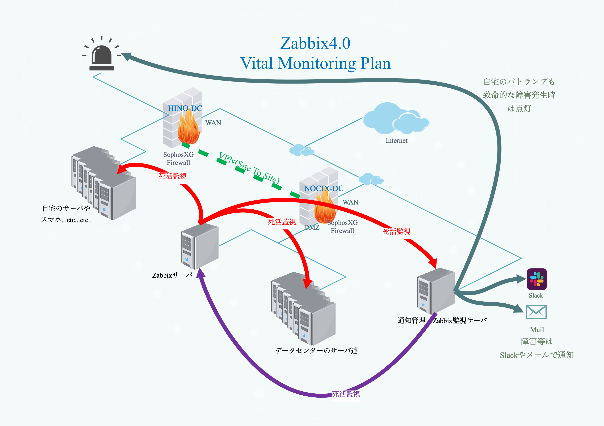

## 監視サーバ(Zabbix)

### 監視設計概要

　監視サーバはNOCIX拠点に借りている専用サーバから、自宅に設置している環境及び、自宅のWIFIに接続可能かつPINGに応答するすべてのデジタル機器の死活監視を行う。  
  死活監視には、Zabbix4.0を利用し、各種通知の管理及び監視サーバの死活監視を行うシステムを別途自作する。
　また、障害発生時や数日以内に障害に繋がる兆候があった場合は、自宅のデスク上に設置したパトランプを赤色で点滅させる。

---
### 仮想マシン設定情報
| 項目                  | 設定値                         |
| --------------------- | ------------------------------ |
| 仮想マシン名          | [MAIN]monkey2018.k636174.net   |
| インストールOS        | Debian GNU/Linux 9.5 (stretch) |
| コア数                | 4コア                          |
| メモリ                | 2046MB                         |
| アタッチネットワーク  | DMZ                            |
| アタッチネットワーク2 | LAN                            |
| ディスク              | 500GB(スパース)                |
| 主な用途              | ZabbixServer,SyslogServer      |

### OS設定値
| 項目       | 設定値                 |
| ---------- | ---------------------- |
| ホスト名   | monkey2018.k636174.net |
| IPアドレス | 172.16.16.105          |

### Cron設定状況
| 実行日時（間隔） | 実行するコマンド |
| ---------------- | ---------------- |
| -                | -                |

### 稼働サービス
| サービス名    | バージョン | 自動起動 |
| ------------- | ---------- | -------- |
| SSH           | 7.4p1      | yes      |
| rsyslogd      | 8.24.0     | yes      |
| zabbix_server | 4.0.0      | yes      |
| zabbix_agent  | 4.0.0      | yes      |

### ZabbixServer設定

#### アクション
| 設定値                                   | 項目                                           |
| ---------------------------------------- | ---------------------------------------------- |
| Name                                     | [MASTER]ZabbixCollector                        |
| 実行条件                                 | ラベル：A　名前：	トリガーの深刻度 以上 未分類 |
| 有効                                     | Checked                                        |
| デフォルトのアクション実行ステップの間隔 | 5m                                             |
| ステップ                                 | 1-0(無限)                                      |
| コマンド                                 | curl -F "hostname={HOST.NAME}" -F "ip={HOST.IP}"  -F "status={EVENT.STATUS} " -F "trigger_name={EVENT.NAME}" -F "trigger_severity={EVENT.SEVERITY}" -F "item_key={ITEM.KEY}" -F "item_val={ITEM.VALUE}" -F "event_id={EVENT.ID}" -F "torigger_url={TRIGGER.URL}"  http://172.16.16.99/zabbix-collector/api/alerts                                               |
