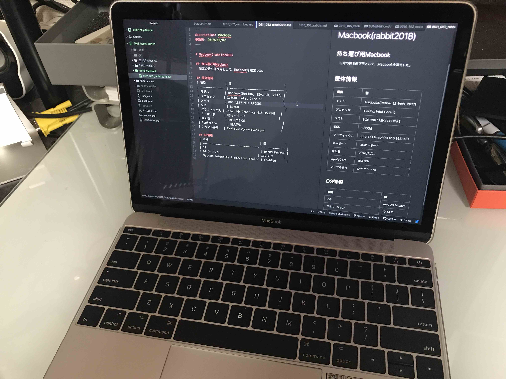

# Macbook(rabbit2018)

## 持ち運び用Macbook
　日常の持ち運び用として、Macbookを選定した。

## 筐体情報
| 項目           | 値                             |
| -------------- | ------------------------------ |
| モデル         | Macbook(Retina, 12-inch, 2017) |
| プロセッサ     | 1.3GHz Intel Core i5           |
| メモリ         | 8GB 1867 MHz LPDDR3            |
| SSD            | 500GB                          |
| グラフィックス | Intel HD Graphics 615 1538MB   |
| キーボード     | USキーボード                   |
| 購入日         | 2018/11/23                     |
| AppleCare      | 購入済み                       |
| シリアル番号   | C\*\*\*\*\*\*\*\*\*\*4         |

## OS情報
| 項目                               | 値           |
| ---------------------------------- | ------------ |
| OS                                 | macOS Mojave |
| OSバージョン                       | 10.14.2      |
| System Integrity Protection status | Enabled      |

## dotfiles
下記リポジトリから、cloneしたりpullしたりcommitする感じの運用で。
https://github.com/k636174/dotfiles.git

